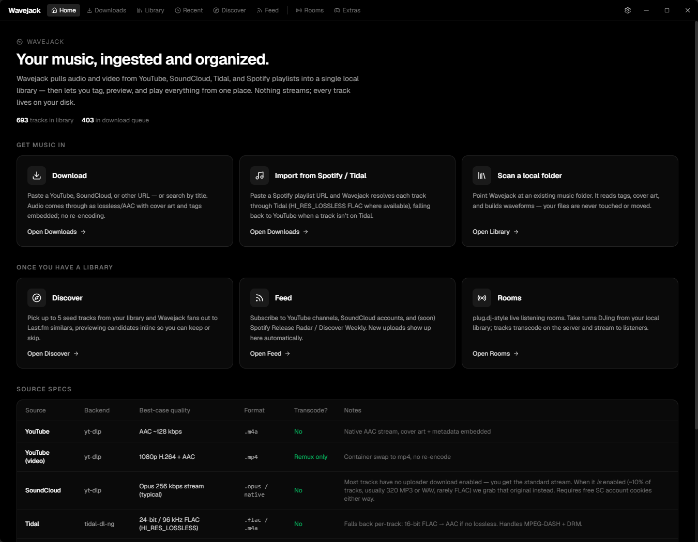
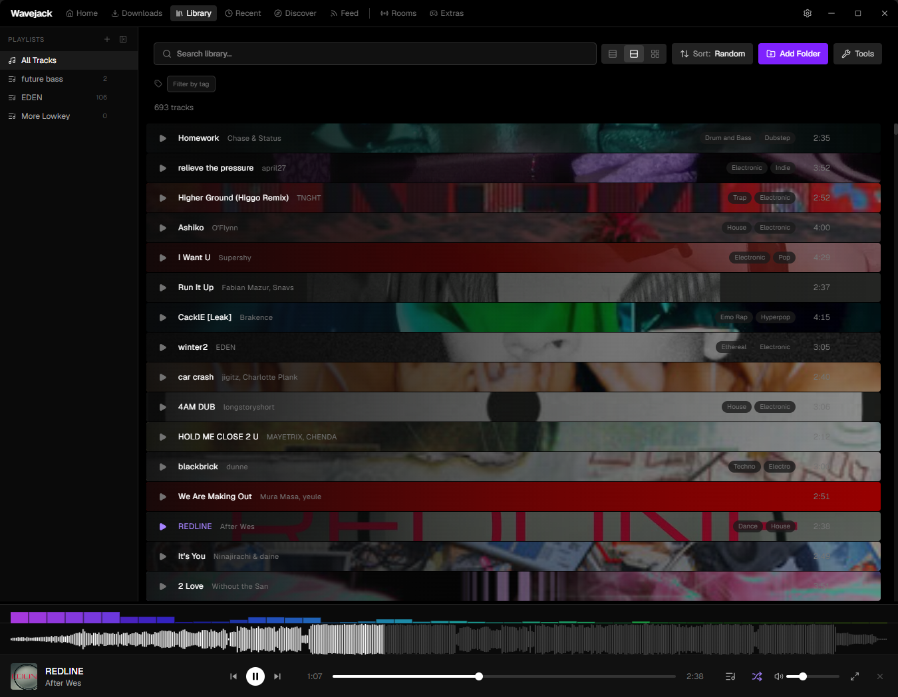
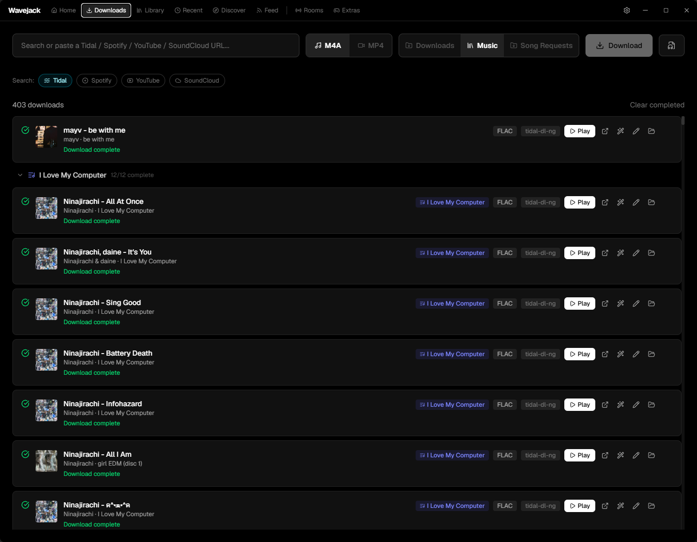
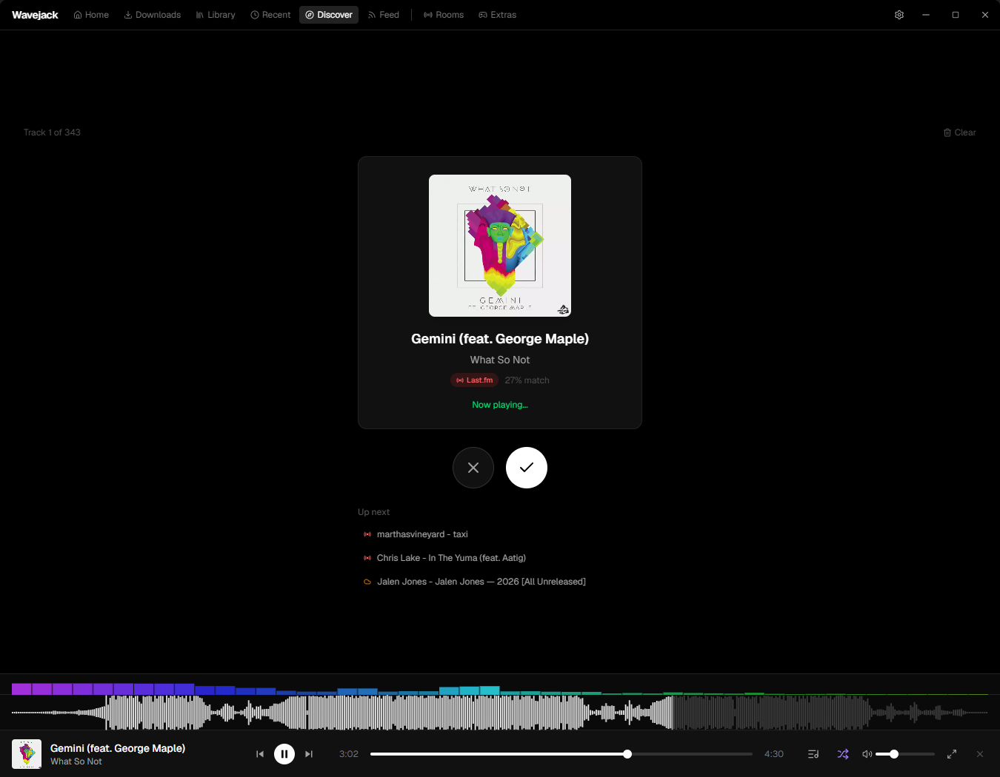
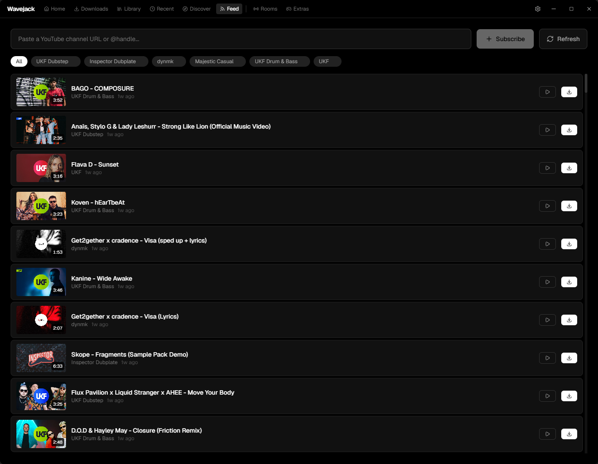
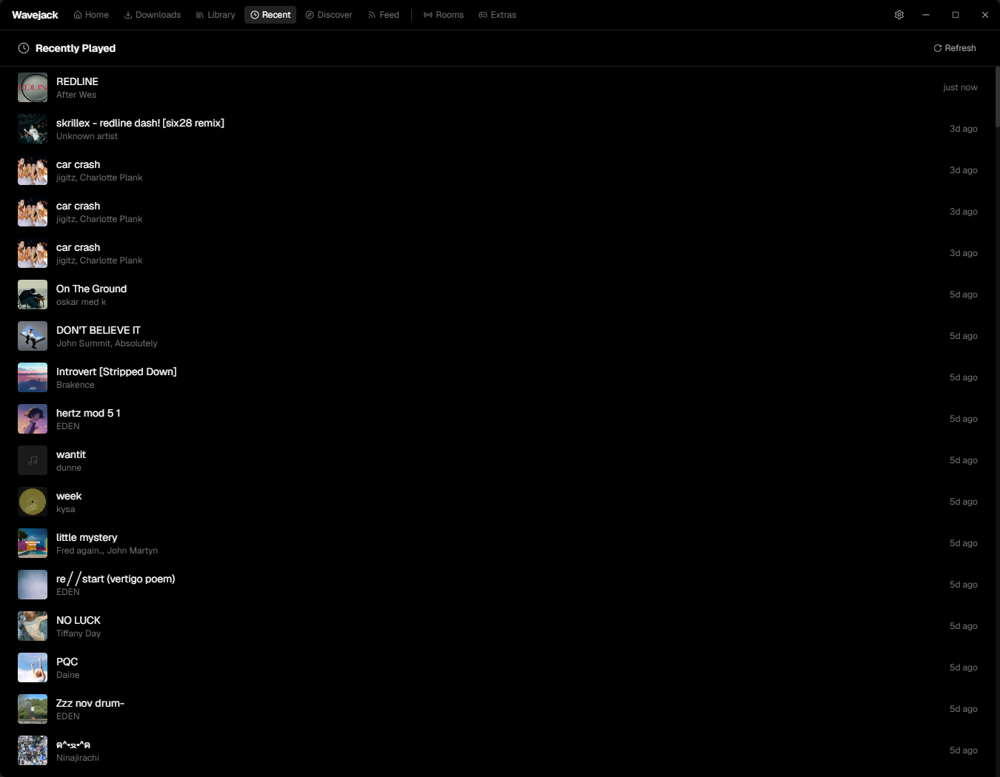
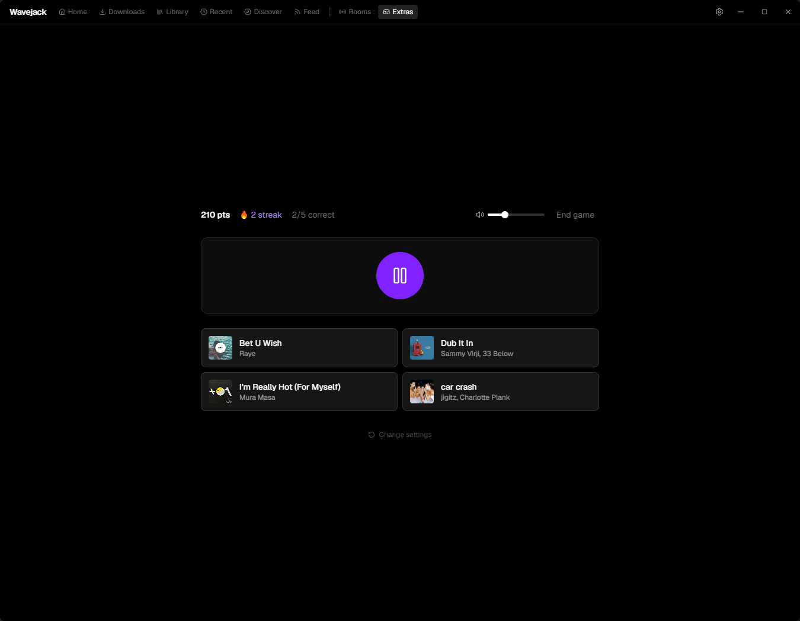

# Wavejack

A desktop app for downloading, organizing, and sharing music.



## Where this fits

Wavejack is the **acquisition + casual-playback** corner of a four-repo personal music/DJ tooling ecosystem (all under [`github.com/ckhawks`](https://github.com/ckhawks)):

- **wavejack** (this repo · Windows) — download + tag music, casual local player, plug.dj-style Rooms.
- **[music-library-tools](https://github.com/ckhawks/music-library-tools)** (Mac) — offline Rekordbox library curation + quality re-sourcing.
- **[puck-festival-tools](https://github.com/ckhawks/puck-festival-tools)** (Mac + VPS) — live browser-streaming DJ set + the rekordbox beat extractor.

Boundaries worth knowing before building here:

- Wavejack's SQLite library is **casual/personal** — deliberately *not* a competitor to Rekordbox, the canonical DJ library on the Mac. Well-tagged files hand off to that world through a synced **inbox** folder.
- **Rooms** (casual, plays local files) is a different product from puck-festival's **live DJ set** (a real performance off Rekordbox/BlackHole).
- Planned **"Go Live"** reuses puck-festival's `livekit-publisher` as the reference impl; library-hygiene borrows its `matcher.py` gates (see [`docs/library-hygiene.md`](./docs/library-hygiene.md)).

Full picture — all four repos, how they connect, the shared inbox funnel, and the settled cross-repo decisions — lives in the **ecosystem map**: [`puck-festival-tools/ecosystem-map.md`](https://github.com/ckhawks/puck-festival-tools/blob/main/ecosystem-map.md).

## Features

### Downloader
- Download audio/video from YouTube, SoundCloud, and 1000+ sites via yt-dlp
- Fallback to self-hosted Cobalt instance
- MP3/MP4 format selection
- Playlist detection and batch downloading
- Auto-tag with MusicBrainz metadata and cover art
- Built-in audio player with album art, seek, and volume

### Rooms (coming soon)
- Create or join DJ rooms
- Take turns playing music from your local library
- Upvote, downvote, or save tracks to your own collection
- Real-time chat and synchronized playback

## Screenshots

| Library — tagged tracks with live waveforms | Downloads — batch queue |
| :---: | :---: |
|  |  |
| **Discover — Last.fm-style recommendations** | **Feed — channel & account subscriptions** |
|  |  |
| **Recent** | **Guessing game (Extras)** |
|  |  |

## Tech Stack

| Component | Stack |
|-----------|-------|
| Desktop app | Tauri v2 (Rust) + React + TypeScript |
| Styling | Tailwind CSS v4 |
| State | Zustand |
| Database | SQLite (local download history) |
| Room server | TypeScript + WebSockets |
| Audio processing | ffmpeg (server-side transcoding) |

## Project Structure

```
wavejack/
├── app/           # Tauri desktop app
│   ├── src/       # React frontend
│   └── src-tauri/ # Rust backend
├── api/           # Room/streaming server
│   └── src/
└── CLAUDE.md      # Development guidelines
```

## Getting Started

### Prerequisites
- [Node.js](https://nodejs.org/) + [pnpm](https://pnpm.io/)
- [Rust](https://rustup.rs/)
- [ffmpeg](https://ffmpeg.org/) (for audio processing)

### Desktop App
```bash
cd app
pnpm install
pnpm tauri dev
```

### API Server
```bash
cd api
pnpm install
pnpm dev
```

## License

TBD
