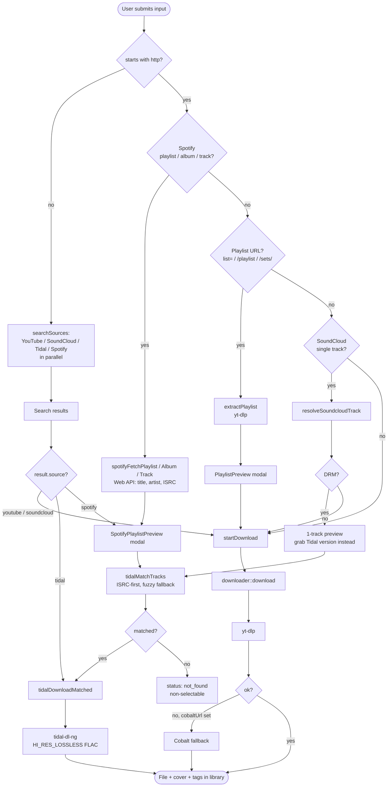

# Wavejack download & ingest paths

## 0. Routing overview

How a pasted URL or search result is dispatched to a backend. Client-side routing
lives in `UrlInput.tsx` (`handleSubmit` / `handleDirectDownload`); backend selection
for the yt-dlp path is in `downloader.rs`.

> **Note:** unmatched Spotify/Tidal tracks currently end at `not_found` and are
> non-selectable — there is **no** automatic yt-dlp/YouTube fallback in code today.
> Adding one would go after `tidalMatchTracks` in `SpotifyPlaylistPreview.tsx`.

## 1. URL / search box (the main input)

**Primary backend: yt-dlp.** Supports 1000+ sites. The format selection flips based on site and requested format:

| Source | Requested | yt-dlp format string | Final file | Transcode? |
|---|---|---|---|---|
| YouTube | M4A (audio) | `bestaudio[ext=m4a]/bestaudio[acodec^=mp4a]/bestaudio[ext=mp3]/bestaudio` | `.m4a` (AAC ~128 kbps) | No |
| YouTube | MP4 (video) | `bv*[vcodec^=avc1]+ba[acodec^=mp4a]/... + --merge-output-format mp4` | `.mp4` (H.264/AAC) | No, container remux only |
| SoundCloud | any | `download/bestaudio/best` | `.wav` / `.flac` / `.mp3` / `.m4a` (whatever the uploader posted, or 128/160 kbps stream if no SC cookies configured) | No |
| Everything else | M4A | same as YouTube audio chain | Whatever the site serves as its best AAC-ish stream, else site-native | No (skips Opus/webm unless it's the only option) |

**Fallback backend: Cobalt** (self-hosted instance via `cobaltUrl` setting). Kicks in if yt-dlp fails. Returns whatever Cobalt negotiated with the source.

**Post-processing on every yt-dlp download:**
- `--write-thumbnail --convert-thumbnails jpg` — writes sidecar `.jpg`
- `--embed-thumbnail --embed-metadata` (audio path) — yt-dlp embeds cover art (via bundled mutagen) and tags (via ffmpeg) into the file
- Rust side reads the sidecar jpg, base64-encodes it for the DB (`cover_art_base64`), then deletes the sidecar
- MP3-only: legacy id3 crate also writes the picture frame if it's missing — belt-and-suspenders, effectively a no-op for m4a

## 2. Spotify playlist / album / track import

- Auth: PKCE via user's own Spotify Web API app (`spotifyClientId` / `spotifyClientSecret`)
- Playlist, album, and single-track URLs all route here (not yt-dlp). Wavejack fetches track metadata (title/artist/album/ISRC) from the Spotify Web API. Albums use the `/albums/{id}/tracks` endpoint, which omits ISRC, so IDs are re-hydrated via batched `/tracks?ids=` calls to recover ISRCs.
- Each track is then resolved externally — Spotify gives us identity, not audio. Resolution: look up ISRC on Tidal → if found, use the Tidal download path (below). If Tidal has no match, the track is marked `not_found` and left non-selectable — there is currently **no** automatic yt-dlp/YouTube fallback.
- So Spotify is an **ingest list**, not a download source

## 3. Tidal (direct + as Spotify resolver)

- Auth: Tidal device-code login (user logs in once via browser)
- Matching: Spotify → Tidal by ISRC lookup; fuzzy title/artist search (duration ±3s) if ISRC misses; unmatched tracks stay `not_found`
- Download: shells out to `tidal-dl-ng` (`tidal_download.rs`)
- Quality: `quality_audio = HI_RES_LOSSLESS` — gives 24-bit FLAC where available, 16-bit FLAC for lossless-only tracks, AAC `.m4a` for HIGH-only tracks. tidal-dl-ng handles Tidal's MPEG-DASH + DRM — we don't reimplement that
- Metadata/cover: tidal-dl-ng embeds natively (`metadata_cover_embed`, `metadata_write`, `metadata_lyrics_embed` all `True`). Wavejack doesn't touch the file after

## 4. Subscriptions (channel feeds)

- User adds a YouTube channel/feed URL
- Wavejack periodically checks for new uploads via yt-dlp and ingests them through the same yt-dlp path as a manual download

## 5. Discover (Last.fm similars + preview)

- User picks seed tracks → Last.fm `track.getSimilar` returns candidates
- Preview audio is downloaded on demand through the yt-dlp search path (`ytsearch1:artist - title`), stored in a previews folder
- "Keep" moves the file into the library; "trash" deletes it

## 6. Library scan (no network)

- User points Wavejack at a folder → it walks the tree, reads existing tags + cover art, computes waveforms via ffmpeg, stores everything in SQLite
- Nothing is transcoded or modified — this is read-only ingest

## What we never do

- Re-encode losslessly sourced audio (SoundCloud originals stay in their native container; Tidal FLAC stays FLAC)
- Touch files from library scans
- Serve or upload user audio anywhere

---

## Ideas

### Home tab

New users have no entry point that explains the model ("does it stream? does it rip? what's the difference between Spotify import and Tidal?"). A homepage with three panels — **Download** (URL/search box), **Import** (Spotify/Tidal buttons), **Library** (scan local folders) — each with a one-sentence explanation of what actually happens, would make the whole thing legible in 10 seconds. Keep it short: ~6 bullets total, not reference-doc length.

### Tidal/Spotify search in the URL box

We already have auth + matching logic for both. The shape:

- User types "deadmau5 strobe" in the URL/search box
- Fan out: yt-dlp search (YouTube), Tidal search API, Spotify search API
- Results list shows each with source badge + quality indicator (Tidal HI_RES_LOSSLESS vs YouTube M4A vs SC original-download)
- User picks one; download routes to the matching backend

Worth it because Tidal results will almost always be higher quality than the YouTube fallback, and right now the only way to hit the Tidal download path is through a Spotify playlist import. Main tradeoff is latency — three concurrent API calls on every keystroke needs debouncing (300–500ms) and the Spotify/Tidal calls need graceful "not authed" handling so users without those accounts don't see errors.
